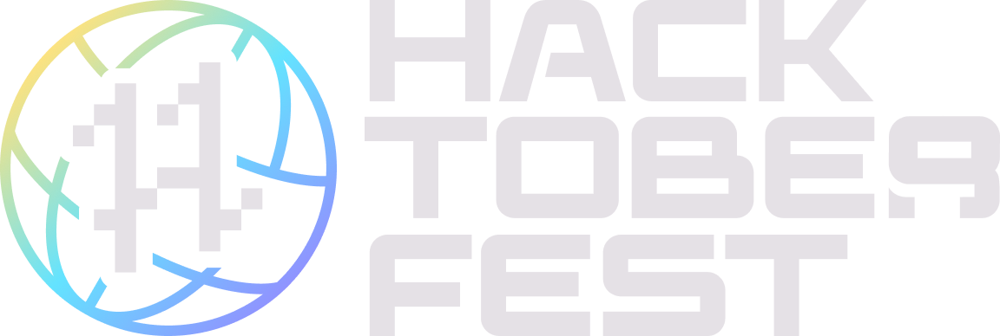

**Build Lightning Apps and Components from the [Idea list](../../README.md#app-ideas)**

______________________________________________________________________

  <a href="#app-ideas">App Ideas</a> •
  <a href="#latest">Latest Apps</a> •
  <a href="https://lightning.ai/">Website</a>

# HacktoberFest 2022

## Contributors ✨

Thanks go to these wonderful people ([emoji key](https://allcontributors.org/docs/en/emoji-key)):

<!-- ALL-CONTRIBUTORS-LIST:START - Do not remove or modify this section -->
<!-- prettier-ignore-start -->
<!-- markdownlint-disable -->
<table>
  <tbody>
    
  </tbody>
</table>

<!-- markdownlint-restore -->
<!-- prettier-ignore-end -->

<!-- ALL-CONTRIBUTORS-LIST:END -->

This project follows the [all-contributors](https://allcontributors.org) specification.
Contributions of any kind are welcome!